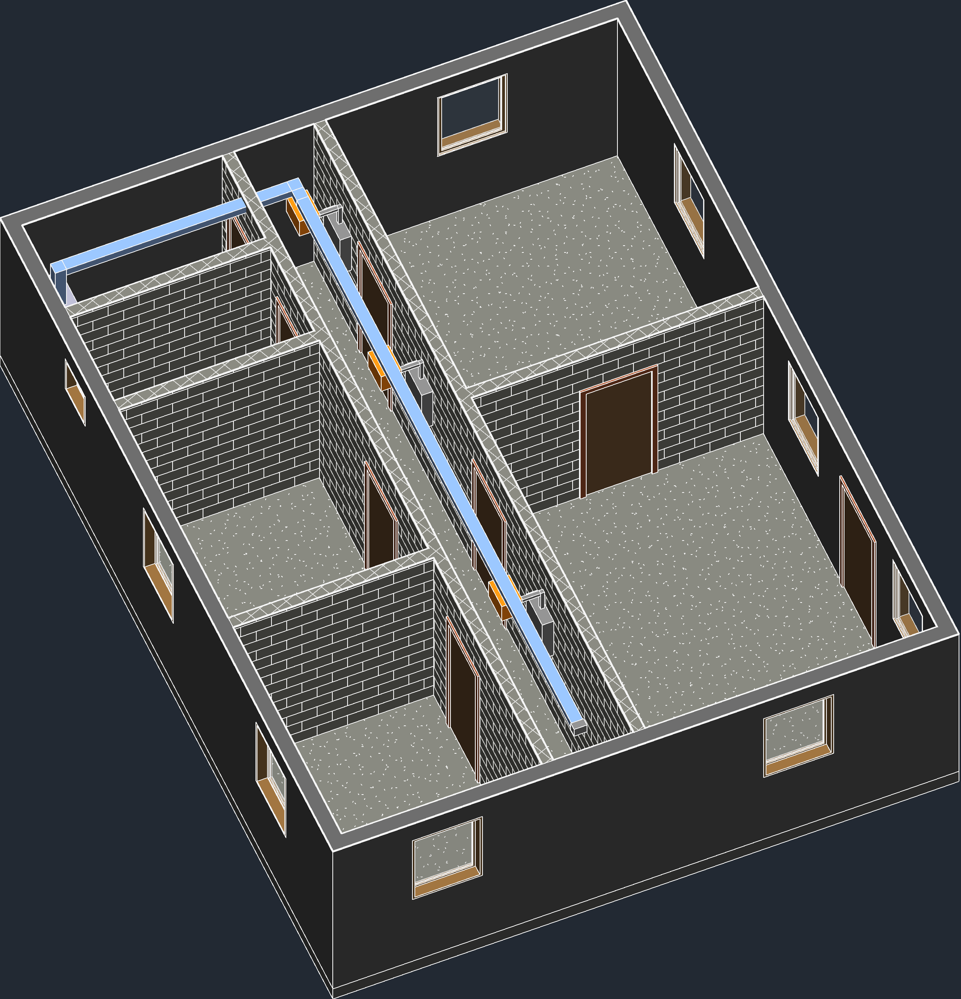
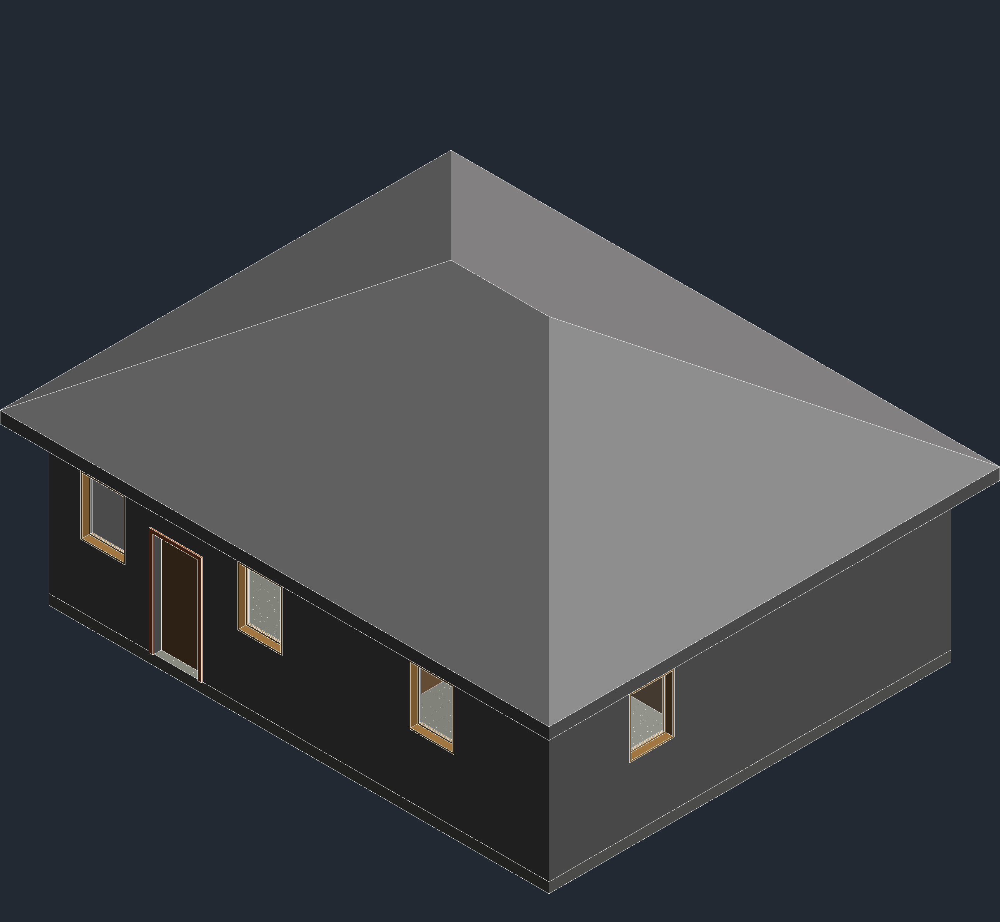
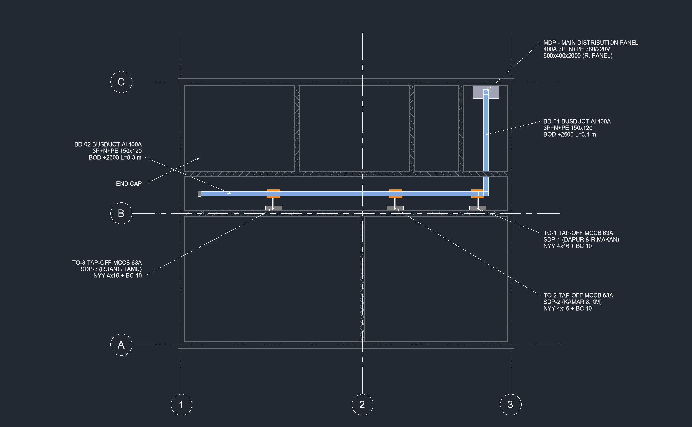
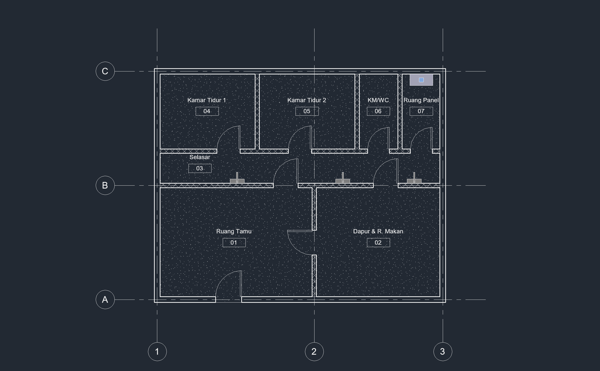

# 01 — Simple House with Busduct Scheme

Single-storey house 10 × 8 m (living room, kitchen/dining, 2 bedrooms, bathroom, panel room) with a simple 400 A busduct scheme running at ceiling level.

## Scope

- Architecture: levels, grids, 200 mm exterior and 150 mm masonry partition walls, doors, windows, floor, 30° hip roof, rooms with tags.
- Electrical (training example): MDP 400 A in the panel room → 400 A busduct 3P+N+PE at +2.60 m along the corridor → 3 tap-off units → SDP-1 (kitchen), SDP-2 (bedrooms & bathroom), SDP-3 (living room).
- Busduct components are modelled as DirectShape elements in the Electrical Equipment category (first exercise, before the custom families used in projects 02 and 03).

## Images

| | |
|---|---|
|  House 3D |  Electrical plan |
|  Architectural plan | |

## Sheets

[`sheets/RumahSederhana_Busduct_Sheets.pdf`](sheets/RumahSederhana_Busduct_Sheets.pdf) — A-101 plan & 3D, E-101 busduct scheme with equipment schedule. PNG in [`sheets/png`](sheets/png).

All ratings are training examples, not a final electrical design.
