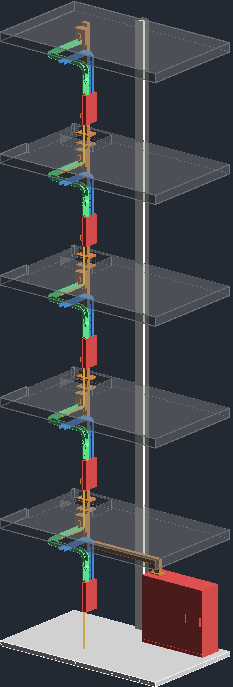
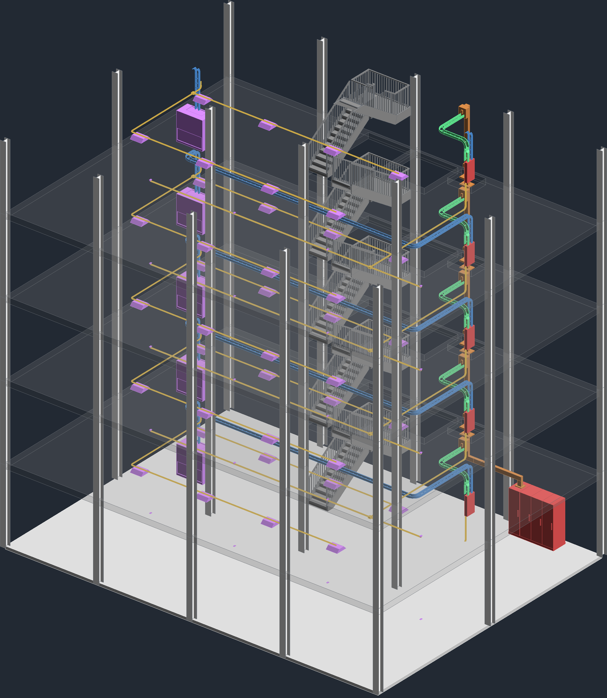
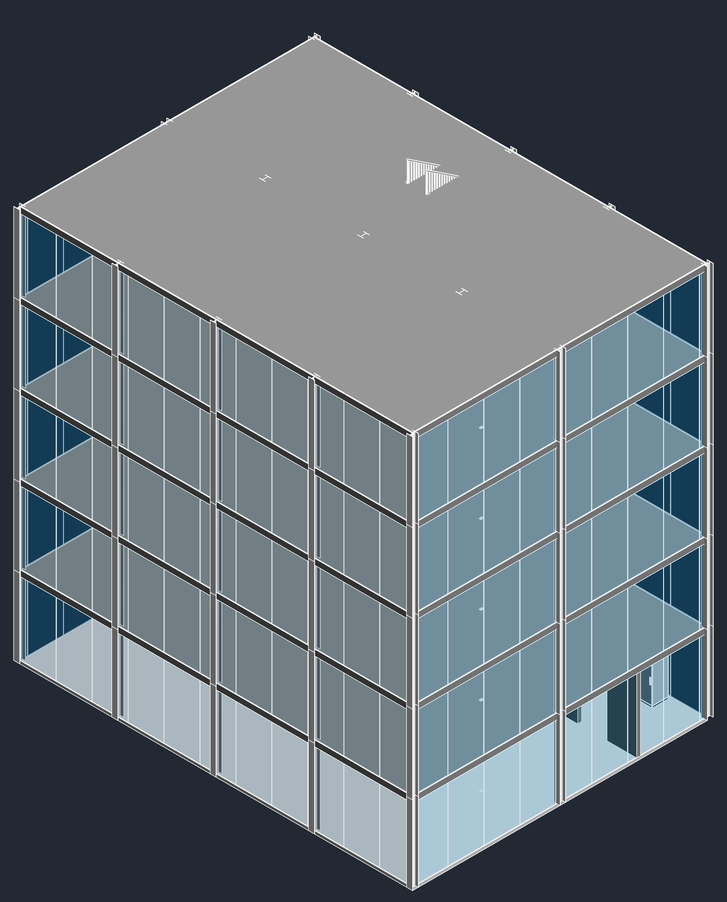
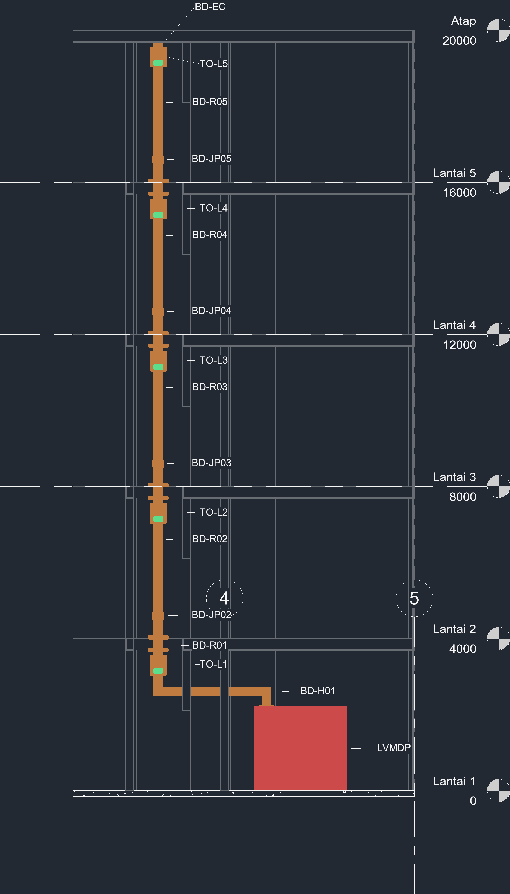

# 02 — 5-Storey Building: Vertical Busduct Riser

Office building 20 × 15 m, 5 floors at 4 m. A vertical LV busduct runs inside a dedicated electrical shaft next to the core (stair + lift), with one tap-off per floor feeding the floor distribution board.

## System

| Item | Value (training example) |
|---|---|
| Main panel | LVMDP 1250 A, 400/230 V, 3P+N+PE, ground floor LV room |
| Riser | 800 A Cu busduct 4P+PE, 5 riser sections BD-R01…R05, joint pack each floor, fire barrier + floor support at every slab |
| Tap-offs | TO-L1…TO-L5, MCCB 250 A |
| Floor boards | DB-L1…DB-L5 (panelboard family), feeder cable tray from tap-off |
| Loads per floor | 8 LED panels, 4 floor-box sockets, 1 AHU 11 kW |
| Final circuits | Lighting: EMT 20 mm conduit from the branch tray, running over each row of luminaires. Sockets: RNC 25 mm conduit cast in the slab from the bottom of DB-Lx to the 4 floor boxes |

Flow: **LVMDP → horizontal feeder busduct → elbow → vertical riser → tap-off → feeder tray → DB-Lx → branch tray / conduit → loads**.

## Images

| | |
|---|---|
|  3D busduct system |  Building |
|  Ground floor plan |  Typical floor plan (L2–L5) |

## Sheets

[`sheets/Gedung5Lt_Busduct_Sheets.pdf`](sheets/Gedung5Lt_Busduct_Sheets.pdf) — E-001 3D isometric + legend, E-101 ground floor, E-102 typical floor, E-201 riser section, E-202 electrical distribution schedule, E-301 load schedule. PNG per sheet in [`sheets/png`](sheets/png).

## Modelling notes

- Custom families (Electrical Equipment): busduct vertical/horizontal section with `Section Length`, elbow, joint pack, fire barrier, tap-off, end cap, flanged end, LVMDP switchboard.
- Shared parameters: Component Name, Component Type, Busduct Rating, Rating, Voltage, Phase, Floor, Panel Name, Connected Panel, System Type.
- View filters colour the system (busduct orange, panels red, feeder tray green, branch tray blue, conduit amber, loads purple).
- Clash check: 0 clashes of busduct, cable trays and conduits with columns, stairs, walls, tap-offs, equipment and luminaires. Remaining intersections are intentional: wall penetrations of busduct/trays, socket conduits cast in the slab and entering the floor boxes.
- Feeder tray enters each tap-off below the MCCB operating handle; the branch tray drops onto the AHU on every floor; every luminaire (40) and floor box (20) is reached by a conduit.
- Interior walls stop at the slab soffit (top offset −300 mm).

All ratings are training examples, not a final electrical design.
