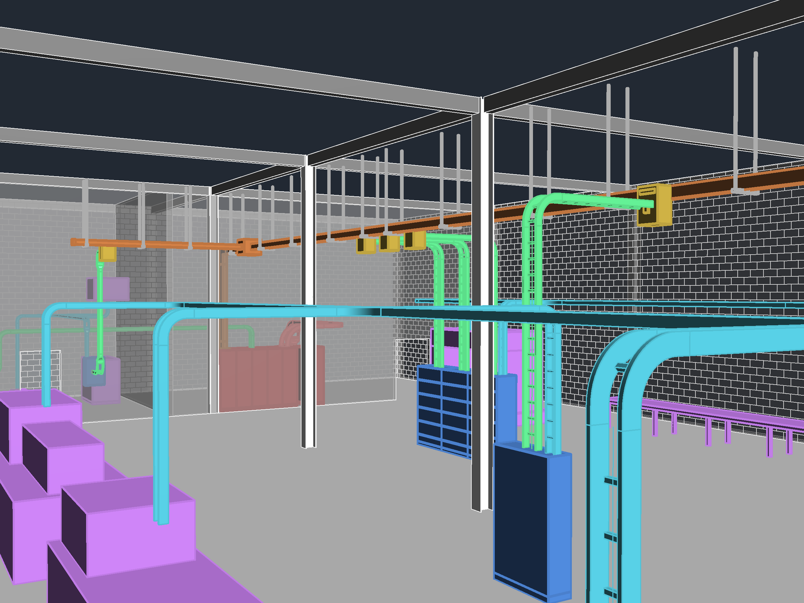
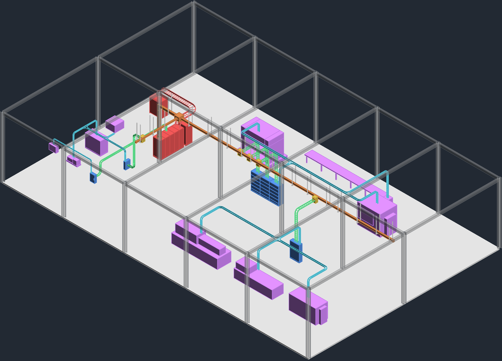
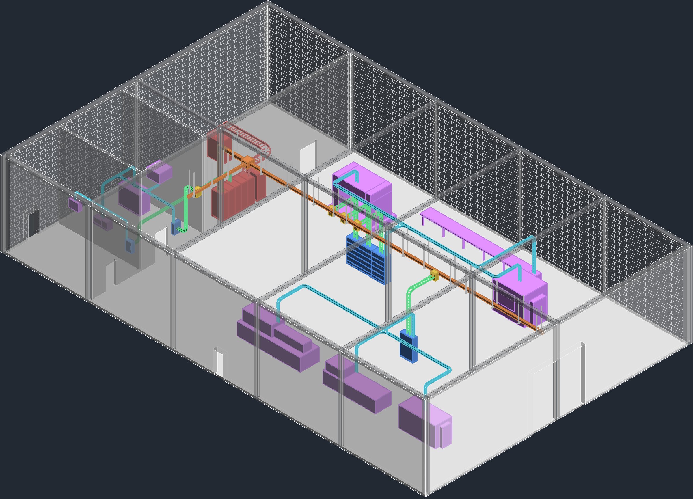
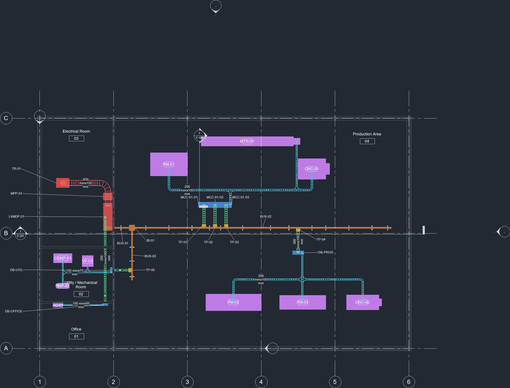
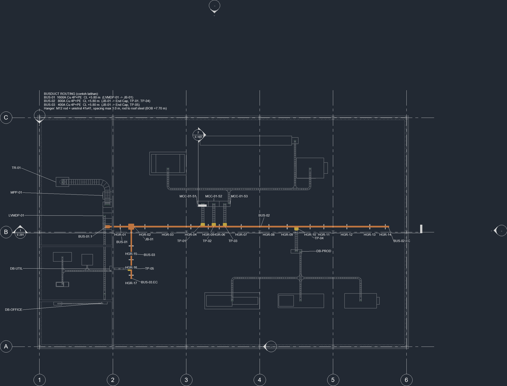
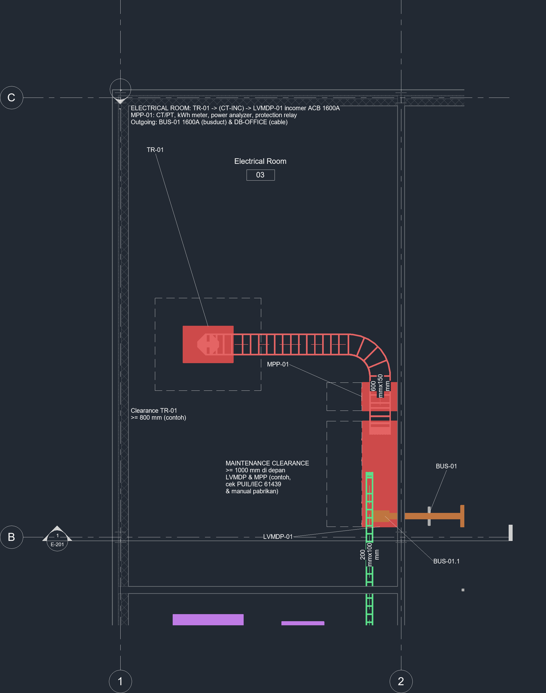
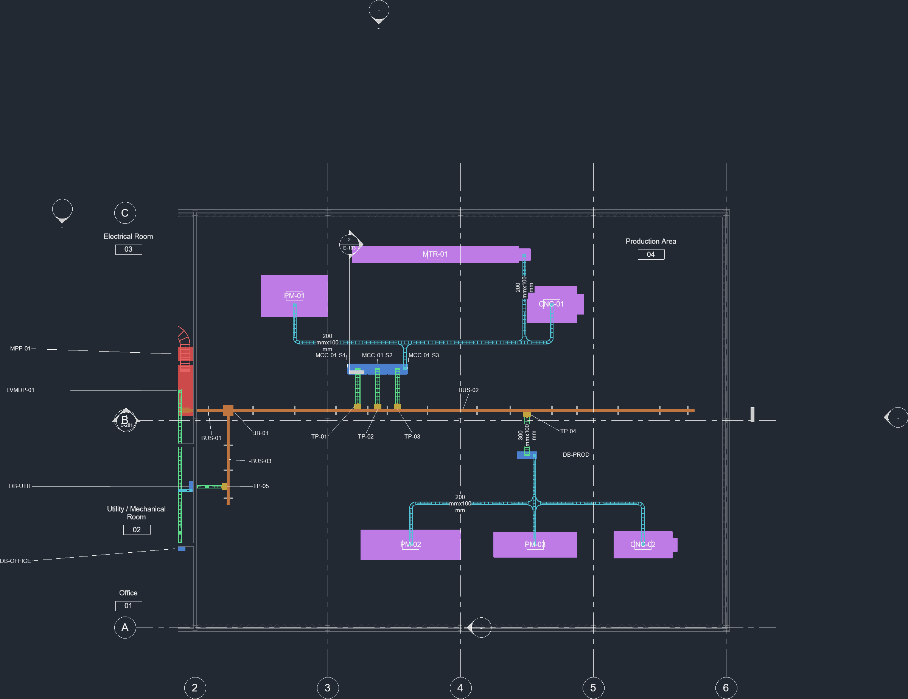
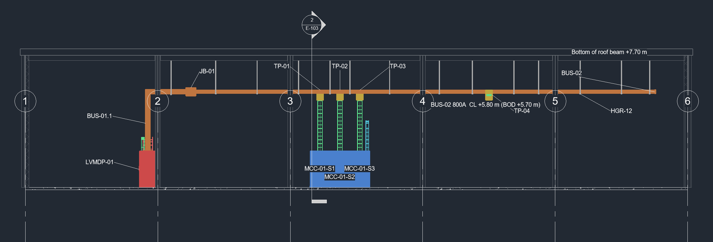
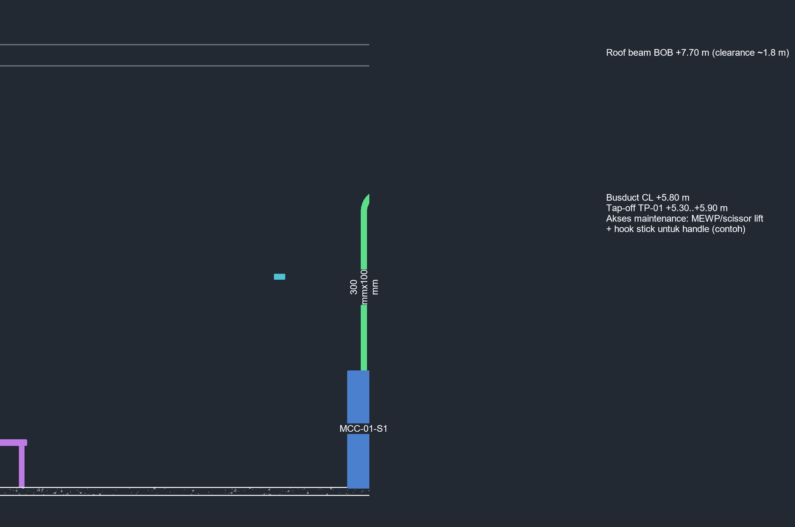
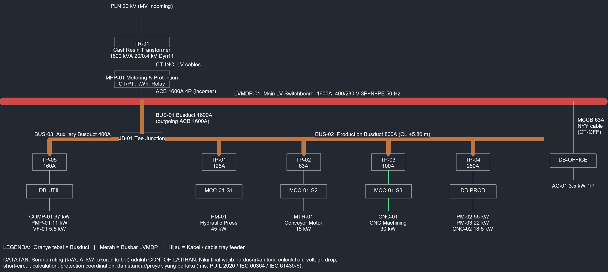

# 03 — Industrial Facility: Busduct Distribution

Manufacturing facility 40 × 25 m, 8 m high, single storey. Power flows **Transformer → LVMDP → Main Busduct → Tap-off → MCC/DB → Industrial Loads**, modelled with native Revit electrical circuits so that panel schedules and load totals are calculated by Revit.



## System

| Item | Value (training example) |
|---|---|
| Supply | TR-01 cast resin transformer 1600 kVA, 20 / 0.4 kV |
| System | 400/230 V, 50 Hz, 3P+N+PE |
| Main switchboard | LVMDP-01, 5 cubicles, ACB 1600 A + MPP-01 metering & protection |
| Main busduct | BUS-01 1600 A → JB-01 tee junction |
| Production busduct | BUS-02 800 A, 27.7 m, TP-01…TP-04 |
| Auxiliary busduct | BUS-03 400 A, 5.3 m, TP-05 |
| Busduct elevation | CL +5.80 m, 17 hangers (max spacing 3.0 m), beam soffit +7.70 m |
| Panels | MCC-01 (3 sections), DB-PROD, DB-UTIL, DB-OFFICE |
| Loads | 10 (hydraulic press, injection molding, packaging line, 2× CNC, conveyor motor, air compressor, pump, ventilation fan, split AC) |
| Connected load | 285.2 kVA on LVMDP-01 (calculated by Revit) |
| Native circuits | 16 (10 load circuits + 6 panel feeders) |

```
TR-01 ─ LVMDP-01 ─┬─ BUS-01 1600A ─ JB-01 ─┬─ BUS-02 800A ─ TP-01 ─ MCC-01-S1 ─ PM-01 Hydraulic Press
                  │                         │               TP-02 ─ MCC-01-S2 ─ MTR-01 Conveyor
                  │                         │               TP-03 ─ MCC-01-S3 ─ CNC-01 Machining Center
                  │                         │               TP-04 ─ DB-PROD  ─ PM-02, PM-03, CNC-02
                  │                         └─ BUS-03 400A ─ TP-05 ─ DB-UTIL  ─ COMP-01, PMP-01, VF-01
                  └─ Cable ─ DB-OFFICE ─ AC-01
```

## Images

| | |
|---|---|
|  3D electrical system |  Overall isometric |
|  Electrical layout plan |  Busduct layout plan |
|  Electrical room plan |  Production area plan |
|  Section A-A (main busduct) |  Section B-B (tap-off) |



## Sheets

Full set: [`sheets/Industri_Busduct_Sheets.pdf`](sheets/Industri_Busduct_Sheets.pdf) (11 × A1). PNG per sheet in [`sheets/png`](sheets/png).

| Sheet | Content |
|---|---|
| E-000 | Single line diagram & legend |
| E-101 | Electrical layout plan |
| E-102 | Busduct layout plan |
| E-103 | Electrical room plan & section B-B |
| E-104 | Production area plan |
| E-201 | Section A-A (main busduct) |
| E-301 | 3D views |
| E-401 | Busduct, tap-off & distribution schedules |
| E-402 | Equipment & electrical circuit schedules |
| E-403 / E-404 | Native panel schedules (DB, MCC, LVMDP) |

## Modelling approach

- **Busduct** — Revit has no busduct category, so busduct runs, elbow, tee, flanged end, end caps, hangers and tap-offs are custom *Electrical Equipment* families with a parametric `Section Length`.
- **Connectivity** — the busduct → tap-off → panel link is represented in three layers: geometry (busduct + cable trays with native fittings), **native power circuits** (MCC/DB fed from LVMDP-01, route noted in circuit comments) and shared parameters (`Connected From`, `Connected To`, `Busduct`).
- **Loads** — Mechanical Equipment families with a Power–Balanced connector (voltage, poles, apparent load, PF 0.85).
- **Outgoing cable trays** — each panel's outgoing tray (with tees/cross) drops onto every load it feeds: PM-01, MTR-01, CNC-01 (MCC-01), PM-02, PM-03, CNC-02 (DB-PROD), COMP-01, PMP-01, VF-01 (DB-UTIL), AC-01 (DB-OFFICE).
- **QC** — 0 clashes between cable trays and busduct/equipment, 0 clashes with columns/beams/roof (wall crossings are intentional penetrations only), all 50 equipment have IDs, all 10 loads circuited and reached by a tray, busduct centreline consistent at +5800 mm.
- **Revision (26-09-2026)** — CT-OFF (LVMDP → DB-OFFICE) rerouted to x = 7.1 m to clear the vertical busduct BUS-01.1; outgoing trays extended to every load.

## Files

- `model/Industri_Busduct.rvt` — Revit 2025 model
- `model/Industri_SharedParameters.txt` — shared parameter file
- `families/` — 28 custom families (BUS_*, TP_*, EQ_*, LD_*, STR_*)

All ratings and sizes are training examples, not a final electrical design.
